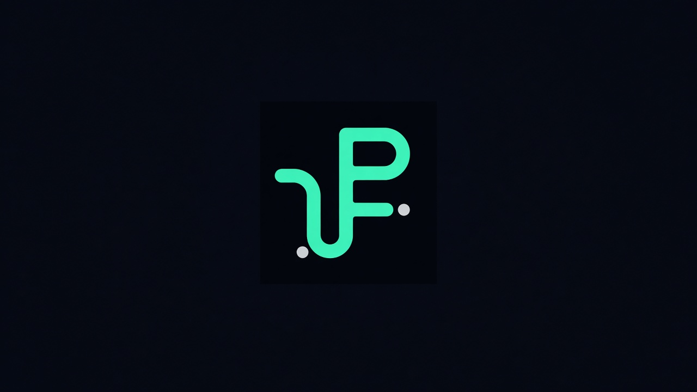

<!-- Mark asset: copy brand/avatars/LOCKED_pax_mark.png -> assets/pax-mark.png in this repo on push -->

 

# Patxi Aguirre

**I diagnose VFX pipelines and make them run themselves.**

Senior Pipeline TD based in Bristol. Colour science, farm reliability, production tracking, and native DCC tooling across the floor. I also build agent-native surfaces so pipeline systems can be operated by people and agents without pasting secrets into a chat.

## What I build

| Area | Focus |
|------|--------|
| Colour pipeline | OCIO / ACES, cross-DCC rules, fail-loud context |
| Render farm | Deadline robustness, honest fail contracts, submit preflight |
| Production tracking and MCP | ShotGrid / FPTR Toolkit, launchers, agent-usable tools |
| Native DCC plugins | Nuke, Houdini, Maya, Blender floor tooling |
| Generative video infrastructure | Production desks, cook/fleet patterns, publish paths |

## Selected work

Capability-level case studies (no legacy repo pins; studio detail stays private):

- **OCIO / ACES** - cross-DCC colour rules and fail-loud context so looks survive write, farm, and publish
- **Deadline farms** - honest fail contracts and submit preflight so green means done
- **ShotGrid / FPTR** - Toolkit engines, launchers, and multi-DCC env that artists actually launch
- **Native tooling** - Nuke / Houdini / Maya / Blender floor tools where Python is not enough
- **Agent-native ops** - MCP and desk surfaces so agents and humans share the same pipeline controls

Full write-ups: [paxflix.com](https://paxflix.com)

## Pipeline Autopsy / Pipe Doctor

**Pipeline Autopsy** finds where a VFX pipeline is lying to you. **Pipe Doctor** is the fix and ops follow-through.

Consulting home: [paxflix.com](https://paxflix.com)

## Stack

Python, Rust, C++, USD, OCIO, Nuke, Houdini, Maya, Blender, Deadline, ShotGrid, Docker, Linux

## Languages

EN / ES / DE / FR

## Contact

[paxflix.com](https://paxflix.com)
